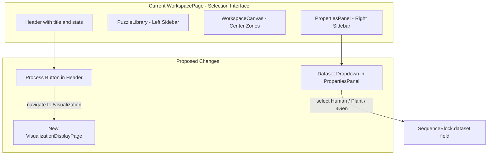

# Implementation Plan: Dataset Options & Process Button

## Overview

Two changes to the WorkspacePage (the current main interface):

1. **Dataset Selection**: Add 3 dataset options (Human, Plant, 3Gen) to the Input Blocks' sequence configuration
2. **Process Button**: Add a "Process" button in the top-right header that navigates to a visualization display page

---

## Architecture Diagram



---

## Change 1: Dataset Selection for Sequences

### 1.1 Update `SequenceBlock` type

**File**: [`src/components/workspace/types.ts`](src/components/workspace/types.ts)

- Add a `DatasetType` union type: `'Human' | 'Plant' | '3Gen'`
- Add `dataset: DatasetType` field to the `SequenceBlock` interface
- Export the `DatasetType` and a `DATASET_OPTIONS` constant array for use in dropdowns

```typescript
export type DatasetType = 'Human' | 'Plant' | '3Gen';

export const DATASET_OPTIONS: { value: DatasetType; label: string; description: string }[] = [
  { value: 'Human', label: 'Human', description: 'Human RNA modification dataset' },
  { value: 'Plant', label: 'Plant', description: 'Plant RNA modification dataset' },
  { value: '3Gen', label: '3Gen', description: 'Third-generation sequencing dataset' },
];
```

Add to `SequenceBlock` interface:
```typescript
dataset: DatasetType;
```

### 1.2 Update `createDefaultSequenceBlock`

**File**: [`src/components/workspace/mockData.ts`](src/components/workspace/mockData.ts)

- Set default `dataset` to `'Human'` in the returned object

### 1.3 Add Dataset Dropdown in PropertiesPanel

**File**: [`src/components/workspace/PropertiesPanel.tsx`](src/components/workspace/PropertiesPanel.tsx)

- Import `DATASET_OPTIONS` and `DatasetType` from `types.ts`
- Add a "Dataset" dropdown (`<select>`) in the `SequenceProperties` component, placed after the Title field and before the Sequence Input textarea
- The dropdown should show the 3 options: Human, Plant, 3Gen
- On change, call `onUpdate({ dataset: value })`

### 1.4 Display Dataset in SequenceBlockCard

**File**: [`src/components/workspace/SequenceBlockCard.tsx`](src/components/workspace/SequenceBlockCard.tsx)

- Show the dataset name as a small tag/badge next to the sequence title or in the meta area

---

## Change 2: Process Button & Visualization Display Page

### 2.1 Create VisualizationDisplayPage

**File**: `src/pages/VisualizationDisplayPage.tsx` (new file)

- A new page component that receives the current workspace state (sequence blocks, viz blocks, model blocks) via React Router state or a shared context
- Displays the visualization results in a full-page layout
- Reuses existing viz components: `ClassificationViz`, `AttentionViz`, `GcnViz`, `TargetGcnViz`, `IntegratedGradientsViz`, `ModelViz`
- Has a "Back to Workspace" button to navigate back to `/`
- Shows a tabbed or scrollable view of all completed visualizations

### 2.2 Add Process Button to WorkspacePage Header

**File**: [`src/pages/WorkspacePage.tsx`](src/pages/WorkspacePage.tsx)

- Import `useNavigate` from `react-router-dom`
- Add a "Process" button in the `workspace-header-actions` div (top-right corner)
- On click, navigate to `/visualization` and pass the current workspace state via `navigate('/visualization', { state: { sequenceBlocks, vizBlocks, modelBlocks } })`
- The button should be visually prominent (primary action style)

### 2.3 Register New Route

**File**: [`src/App.tsx`](src/App.tsx)

- Import `VisualizationDisplayPage`
- Add route: `<Route path="/visualization" element={<VisualizationDisplayPage />} />`

### 2.4 Add CSS Styling

**File**: [`src/pages/WorkspacePage.css`](src/pages/WorkspacePage.css)

- Style the Process button with a prominent accent color (e.g., the viz zone accent color `--ws-viz-accent`)
- Add hover/active states

---

## Files to Modify

| File | Change |
|------|--------|
| [`src/components/workspace/types.ts`](src/components/workspace/types.ts) | Add `DatasetType`, `DATASET_OPTIONS`, `dataset` field to `SequenceBlock` |
| [`src/components/workspace/mockData.ts`](src/components/workspace/mockData.ts) | Add default `dataset: 'Human'` to `createDefaultSequenceBlock` |
| [`src/components/workspace/PropertiesPanel.tsx`](src/components/workspace/PropertiesPanel.tsx) | Add dataset dropdown in `SequenceProperties` |
| [`src/components/workspace/SequenceBlockCard.tsx`](src/components/workspace/SequenceBlockCard.tsx) | Display dataset badge |
| [`src/pages/WorkspacePage.tsx`](src/pages/WorkspacePage.tsx) | Add Process button with navigation |
| [`src/pages/WorkspacePage.css`](src/pages/WorkspacePage.css) | Process button styling |
| [`src/pages/VisualizationDisplayPage.tsx`](src/pages/VisualizationDisplayPage.tsx) | **New file** - Full-page visualization display |
| [`src/App.tsx`](src/App.tsx) | Register `/visualization` route |

---

## Execution Order

1. Update `types.ts` - Add dataset type and field
2. Update `mockData.ts` - Add default dataset value
3. Update `PropertiesPanel.tsx` - Add dataset dropdown
4. Update `SequenceBlockCard.tsx` - Display dataset badge
5. Create `VisualizationDisplayPage.tsx` - New visualization display page
6. Update `WorkspacePage.tsx` - Add Process button with navigation
7. Update `WorkspacePage.css` - Process button styling
8. Update `App.tsx` - Register new route
